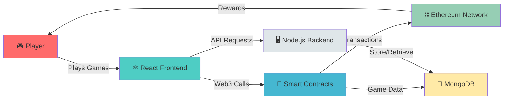

<div align="center">

<!-- Animated Banner with Particle Effects -->


<!-- 3D Crypto Spinning Coins Animation -->


<!-- Particle Effect Divider -->


<!-- Animated Badges with Pulse Effects -->
<p align="center">
  
  
  
  
  
</p>

<!-- Animated Stars and Activity -->
<p align="center">
  
  
  
  
</p>

<!-- 3D Cube Animation -->


</div>

---

## 🎯 **What is ChainCash?**

<div align="center">
  


</div>

**ChainCash** is the future of gaming - a **blockchain-powered gaming platform** where you can:

<div align="center">

| 🎮 **Play** | 💰 **Earn** | 🏆 **Compete** | 🔗 **Trade** |
|:---:|:---:|:---:|:---:|
| Popular arcade games | Real cryptocurrency | Global leaderboards | In-game NFT assets |
| Skill-based challenges | Token rewards | Tournament prizes | Marketplace trading |

</div>

<!-- Crypto Animation -->
<div align="center">

</div>

---

## ⚡ **Key Features**

<table align="center">
<tr>
<td width="50%" valign="top">

### 🎮 **Gaming Excellence**


- 🕹️ **Multiple Game Modes**
  - Classic Arcade Games
  - Multiplayer Battles
  - Tournament Mode
  - Practice Arena
  
- 🎯 **Skill-Based Gameplay**
  - Fair play mechanics
  - Anti-cheat protection
  - Real-time matchmaking
  - Performance analytics

</td>
<td width="50%" valign="top">

### 💎 **Blockchain Integration**


- ⛓️ **Smart Contract Security**
  - Automated payouts
  - Transparent transactions
  - Immutable records
  - Gas optimization
  
- 🪙 **Token Economics**
  - ChainCash (CCH) Token
  - Staking rewards
  - Governance rights
  - Liquidity pools

</td>
</tr>
</table>

<!-- Particle Divider -->


## 🎲 **Available Games**

<div align="center">

<table>
<tr>
<td align="center" width="33%">
<br>
<b>🐍 Snake Game</b><br>
<sub>Classic arcade action</sub><br>

</td>
<td align="center" width="33%">
<br>
<b>🎯 Target Shooter</b><br>
<sub>Precision & reflexes</sub><br>

</td>
<td align="center" width="33%">
<br>
<b>🏃 Endless Runner</b><br>
<sub>Fast-paced adventure</sub><br>

</td>
</tr>
</table>


</div>

---

## 🛠️ **Technology Stack**

<div align="center">

<!-- Tech Stack Animation -->


<br><br>

<table>
<tr>
<td align="center" width="25%">
<br>
<b>Blockchain</b><br>
<sub>Ethereum, Solidity<br>Web3.js, Hardhat</sub>
</td>
<td align="center" width="25%">
<br>
<b>Frontend</b><br>
<sub>React.js, CSS3<br>HTML5, Web3 UI</sub>
</td>
<td align="center" width="25%">
<br>
<b>Backend</b><br>
<sub>Node.js, Express<br>MongoDB, REST API</sub>
</td>
<td align="center" width="25%">
<br>
<b>DevOps</b><br>
<sub>Git, GitHub<br>Docker, CI/CD</sub>
</td>
</tr>
</table>

</div>

<!-- Animated Divider -->


## 🚀 **Getting Started**

<div align="center">

</div>

### 📋 **Prerequisites**

```bash
🔹 Node.js (v16.0+)
🔹 MetaMask Wallet
🔹 Ethereum Test Network Access
🔹 Git
```

### ⚙️ **Installation Steps**

<details>
<summary><b>Click to expand installation guide</b></summary>

#### 1️⃣ **Clone the Repository**
```bash
git clone https://github.com/ayushap18/ChainCash.git
cd ChainCash
```

#### 2️⃣ **Install Dependencies**
```bash
npm install
```

#### 3️⃣ **Configure Environment**
```bash
cp .env.example .env
# Add your Ethereum private key and RPC URL
```

#### 4️⃣ **Deploy Smart Contracts**
```bash
npx hardhat compile
npx hardhat deploy --network sepolia
```

#### 5️⃣ **Start the Application**
```bash
npm start
```

#### 6️⃣ **Connect MetaMask**
- Open the app in your browser
- Connect your MetaMask wallet
- Make sure you're on the correct network
- Start playing and earning!

</details>

---

## 🎨 **Architecture Overview**

<div align="center">



</div>

<!-- 3D Box Animation -->
<div align="center">

</div>

---

## 💰 **Tokenomics**

<div align="center">

### 🪙 **ChainCash (CCH) Token**


<table>
<tr>
<td align="center" width="25%">

</td>
<td align="center" width="25%">

</td>
<td align="center" width="25%">

</td>
<td align="center" width="25%">

</td>
</tr>
</table>

#### 📊 **Token Distribution**

```
🎮 Gaming Rewards    ████████████████████████████████████████ 40%
💎 Staking Pool      ████████████████████████             20%
🏆 Tournaments       ████████████████                     15%
👥 Team & Advisors   ████████████                         15%
🌊 Liquidity         ██████                               10%
```

</div>

---

## 🏆 **Leaderboard & Rewards**

<div align="center">


### 🥇 **Top Players**

| Rank | Player | Score | Earnings |
|:----:|:------:|:-----:|:--------:|
| 🥇 | Player1 | 15,420 | 2.5 ETH |
| 🥈 | Player2 | 12,890 | 1.8 ETH |
| 🥉 | Player3 | 10,350 | 1.2 ETH |
| 4️⃣ | Player4 | 8,920 | 0.9 ETH |
| 5️⃣ | Player5 | 7,650 | 0.7 ETH |

</div>

---

## 📱 **Screenshots & Demos**

<div align="center">

<!-- Gaming GIF -->


### 🎥 **Live Demo**

<a href="#"></a>
<a href="#"></a>

</div>

---

## 🔒 **Security Features**

<div align="center">

</div>

<table align="center">
<tr>
<td width="50%">

### 🛡️ **Smart Contract Security**
- ✅ Audited by security experts
- ✅ OpenZeppelin standards
- ✅ Reentrancy protection
- ✅ Access control mechanisms
- ✅ Pausable contracts
- ✅ Rate limiting

</td>
<td width="50%">

### 🔐 **User Protection**
- ✅ Encrypted data storage
- ✅ Secure wallet integration
- ✅ Anti-cheat systems
- ✅ Transaction verification
- ✅ Multi-signature wallets
- ✅ Emergency withdrawal

</td>
</tr>
</table>

---

## 🤝 **Contributing**

<div align="center">


### We ❤️ Contributions!


</div>

### 🌟 **How to Contribute**

1. 🍴 **Fork** the repository
2. 🌿 **Create** your feature branch (`git checkout -b feature/AmazingFeature`)
3. 💾 **Commit** your changes (`git commit -m 'Add some AmazingFeature'`)
4. 📤 **Push** to the branch (`git push origin feature/AmazingFeature`)
5. 🎉 **Open** a Pull Request

<details>
<summary><b>📜 Contribution Guidelines</b></summary>

- Follow the existing code style
- Write clear commit messages
- Add tests for new features
- Update documentation
- Be respectful and collaborative

</details>

---

## 📄 **License**

<div align="center">


This project is licensed under the **MIT License** - see the [LICENSE](LICENSE) file for details.

[](https://opensource.org/licenses/MIT)

</div>

---

## 📞 **Contact & Community**

<div align="center">

### 🌐 **Join Our Community!**

<a href="https://twitter.com/chaincash"></a>
<a href="https://discord.gg/chaincash"></a>
<a href="https://t.me/chaincash"></a>
<a href="https://github.com/ayushap18/ChainCash"></a>
<a href="mailto:contact@chaincash.io"></a>

<br><br>


### 💬 **Get Support**

Have questions? Need help? Reach out to us!

<table>
<tr>
<td align="center">
<br>
<b>Documentation</b><br>
<a href="#">View Docs</a>
</td>
<td align="center">
<br>
<b>Support</b><br>
<a href="#">Get Help</a>
</td>
<td align="center">
<br>
<b>Community</b><br>
<a href="#">Join Us</a>
</td>
</tr>
</table>

</div>

---

## 📊 **Project Stats**

<div align="center">


</div>

---

## 🎯 **Roadmap**

<div align="center">

</div>

### 📅 **2025 Q1-Q4**

```
✅ Q1 2025
  ├─ Platform Launch
  ├─ 3 Initial Games
  ├─ Token Distribution
  └─ Community Building

🔄 Q2 2025
  ├─ Mobile App Development
  ├─ 5 New Games
  ├─ NFT Marketplace
  └─ Staking Platform

📋 Q3 2025
  ├─ Multiplayer Tournaments
  ├─ Cross-chain Integration
  ├─ DAO Governance
  └─ Partnerships

🚀 Q4 2025
  ├─ VR Game Integration
  ├─ Global Expansion
  ├─ Major CEX Listings
  └─ ChainCash 2.0
```

---

## 🎁 **Special Features**

<div align="center">

<table>
<tr>
<td align="center" width="33%">
<br>
<b>🎮 Daily Challenges</b><br>
<sub>New challenges every day<br>Earn bonus rewards</sub>
</td>
<td align="center" width="33%">
<br>
<b>💎 NFT Rewards</b><br>
<sub>Collect rare items<br>Trade in marketplace</sub>
</td>
<td align="center" width="33%">
<br>
<b>🏆 Tournaments</b><br>
<sub>Compete globally<br>Win big prizes</sub>
</td>
</tr>
</table>

</div>

---

## ⚠️ **Disclaimer**

<div align="center">

```
⚠️ This is a blockchain-based platform. Please play responsibly.
🔒 Always secure your private keys and never share them.
💰 Cryptocurrency investments carry risk. Do your own research.
🎮 Gaming should be fun and entertaining, not addictive.
```

</div>

---

<div align="center">

<!-- Footer Animation -->


### 🌟 **Made with ❤️ by the ChainCash Team** 🌟


<br>

<!-- Social Stats -->


<br><br>

**© 2025 ChainCash. All Rights Reserved.**


</div>
