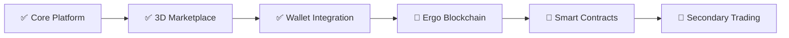

<div align="center">

# ⚡ ChainCash ⚡
### *Tokenized Gaming Crowdfunding on Blockchain*


[](https://nextjs.org/)
[](https://docs.pmnd.rs/react-three-fiber)
[](https://www.typescriptlang.org/)
[](https://tailwindcss.com/)
[](https://ethereum.org/)


</div>

---

## 🎮 What is ChainCash?

<table>
<tr>
<td width="60%">

**Revolutionizing indie game funding** through blockchain-secured **ChainCash Notes** - tradeable tokens representing pre-launch game assets.

🔗 **Blockchain Security** • 💎 **True Ownership** • 🔄 **Secondary Trading** • 🛡️ **Milestone-Based Release**

> Built on Ergo ecosystem principles for tokenized gaming economies

</td>
<td width="40%">

```typescript
interface ChainCashNote {
  assetId: string;
  issuer: string;
  holder: string;
  denomination: number;
  isRedeemable: boolean;
}
```

</td>
</tr>
</table>

---

## ⚡ Features

<div align="center">

| 🎯 For Backers | 🛠️ For Developers |
|:---|:---|
| 🌐 **3D Asset Marketplace** with React Three Fiber | 📊 **Campaign Management Dashboard** |
| 💳 **MetaMask Integration** & Crypto Checkout | 🎯 **Milestone System** with rewards |
| 🎨 **Interactive 3D Cards** with rarity effects | 📈 **Backer Analytics** & performance tracking |
| 💼 **Asset Portfolio** tracking & redemption | 🔧 **Asset Creator** with pricing controls |

</div>

---

## 🔥 Tech Stack

<div align="center">


| Layer | Technology |
|:---:|:---|
| 🎨 **Frontend** | Next.js 16 (App Router) + TypeScript |
| 🎭 **3D Graphics** | React Three Fiber + drei |
| 💅 **Styling** | Tailwind CSS + Framer Motion |
| ⚡ **State** | Zustand |
| 🔐 **Web3** | Ethereum Provider (MetaMask) |

</div>

---

## 🚀 Quick Start

```bash
# Clone the repo
git clone https://github.com/ayushap18/ChainCash.git
cd ChainCash

# Install dependencies
npm install

# Run development server
npm run dev
```

<div align="center">

**🌐 Open [http://localhost:3000](http://localhost:3000)**

</div>

---

## 💎 Asset Rarity System

<div align="center">

| Rarity | Color | Effect |
|:---:|:---:|:---:|
| ⚪ **Common** | Gray | Standard glow |
| 🟢 **Uncommon** | Green | Soft pulse |
| 🔵 **Rare** | Blue | Wave animation |
| 🟣 **Epic** | Purple | Particle trail |
| 🟡 **Legendary** | Amber | Aura effect |
| 🔴 **Mythic** | Red | Cosmic particles |

</div>

---

## 📁 Architecture

```
src/
├── app/                    # Next.js pages
│   ├── campaigns/         # Campaign browser
│   ├── marketplace/       # 3D asset marketplace
│   └── my-assets/         # User portfolio
├── components/
│   ├── 3d/               # React Three Fiber scenes
│   ├── ui/               # UI components
│   └── wallet/           # Web3 integration
└── stores/               # Zustand state management
```

---

## 🛣️ Roadmap

<div align="center">



</div>

- [x] 3D marketplace with React Three Fiber
- [x] MetaMask wallet integration
- [x] Campaign & asset management
- [x] Shopping cart & checkout
- [ ] Ergo blockchain integration
- [ ] Smart contract deployment
- [ ] Secondary marketplace
- [ ] Mobile responsive 3D

---

## 🤝 Contributing

<div align="center">


**Contributions welcome!** Fork • Code • PR

```bash
git checkout -b feature/amazing-feature
git commit -m 'Add amazing feature'
git push origin feature/amazing-feature
```

</div>

---

## 📄 License

<div align="center">

MIT License © 2025 ChainCash

**Built with 💜 for indie game developers**


---

### 🌟 Star us on GitHub — it motivates us a lot!

[](https://github.com/ayushap18/ChainCash/stargazers)
[](https://github.com/ayushap18/ChainCash/network/members)

</div>